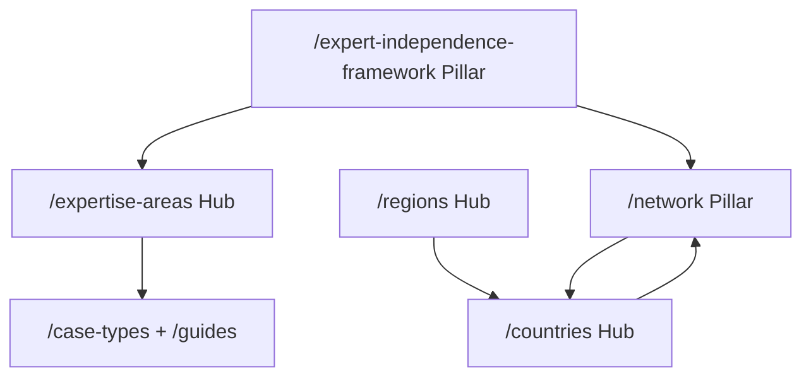
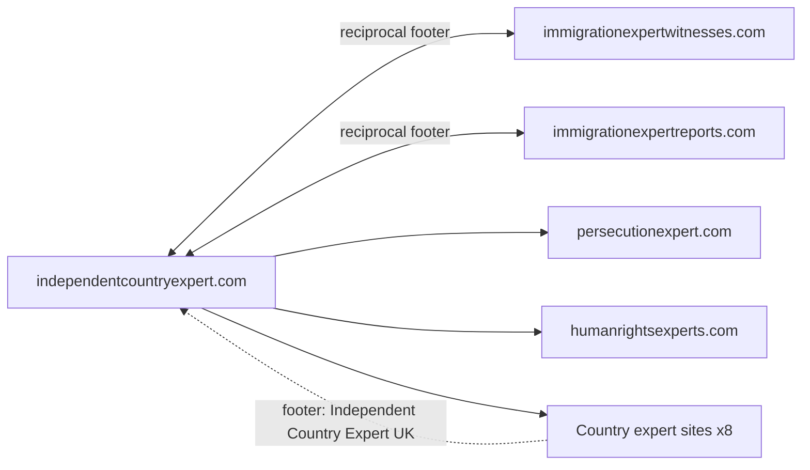

# SEO Architecture — independentcountryexpert.com

**Canonical domain:** `https://www.independentcountryexpert.com`  
**Site name:** Independent Country Expert  
**Locale:** `en_GB` (UK immigration solicitors, tribunal practitioners, Legal Aid)  
**Role:** Independence + country expertise master hub (routing, not country-deep duplication)

This document is the single source of truth for keyword strategy, unique content assets, content clusters, network positioning, GEO (Generative Engine Optimization), off-page SEO, internal linking, schema architecture, and launch deployment for independentcountryexpert.com. All slugs and URLs align with the canonical SEO brief naming convention.

**Implementation status:** Target architecture (June 2026). Greenfield repo — no routes implemented yet. Run `npm run seo:generate && npm run seo:verify` after content or route changes.

---

## 1. Keyword Strategy

### Tier 1 — Transactional

**Target pages:** homepage, services, expertise areas, qualifications, case types, contact.

| Keyword | Primary URL |
|---------|-------------|
| independent country expert UK | `/` |
| independent country expert witness UK | `/`, `/what-is-an-independent-country-expert` |
| country expert witness UK immigration | `/`, `/expertise-areas/country-condition-analysis` |
| independent country condition report UK | `/services`, `/report-standards` |
| country expert asylum tribunal UK | `/case-types/ftt-asylum-appeal`, `/qualifications` |
| independent expert witness country conditions | `/expert-independence-framework`, `/expertise-areas/country-condition-analysis` |
| country expert report solicitor UK | `/how-to-instruct`, `/guides/instructing-country-expert-guide` |
| Legal Aid country expert witness UK | `/guides/legal-aid-country-expert-guide`, `/fees` |
| immigration tribunal country expert UK | `/qualifications`, `/case-types/ftt-asylum-appeal` |
| independent asylum country expert UK | `/`, `/expertise-areas/country-condition-analysis` |

### Tier 2 — Informational

**Target pages:** independence pillar, guides, glossary, CPIN framework, report standards.

| Keyword | Primary URL |
|---------|-------------|
| Ikarian Reefer expert witness immigration | `/expert-independence-framework#ikarian-reefer`, `/glossary#ikarian-reefer` |
| CPR Part 35 country expert immigration tribunal | `/expert-independence-framework#cpr-part-35`, `/glossary#cpr-part-35` |
| Practice Direction 2024 expert evidence immigration | `/expert-independence-framework#practice-direction-2024`, `/glossary#practice-direction-2024` |
| Adam Pipe expert report guidance 2025 | `/expert-independence-framework#adam-pipe-2025`, `/glossary#adam-pipe-guidance-2025` |
| independent expert witness duty tribunal | `/expert-independence-framework`, `/guides/expert-independence-guide` |
| CPIN vs expert report immigration UK | `/cpin-country-guidance`, `/guides/cpin-vs-expert-report-guide` |
| country expert witness independence UK | `/expert-independence-framework`, `/report-standards` |
| how to instruct country expert witness UK | `/how-to-instruct`, `/guides/instructing-country-expert-guide` |
| expert witness assumed facts immigration | `/expert-independence-framework#adam-pipe-2025` |
| country condition report standards 2026 | `/report-standards` |

### Tier 3 — Long-tail

**Target pages:** country routing, expertise areas, guides, case types, network directory.

| Keyword | Primary URL(s) |
|---------|----------------|
| independent country expert Somalia Nigeria Pakistan UK | `/countries`, `/network` |
| choosing independent country expert asylum appeal | `/guides/choosing-country-expert-guide`, `/countries` |
| country expert witness cross-examination FTT UK | `/guides/oral-evidence-country-expert-guide`, `/expertise-areas/oral-evidence-tribunal` |
| CPIN challenge independent expert report UK | `/expertise-areas/cpin-challenge-reports`, `/cpin-country-guidance` |
| Legal Aid country expert witness prior authority 2026 | `/guides/legal-aid-country-expert-guide`, `/fees` |
| independent country expert oral evidence tribunal | `/expertise-areas/oral-evidence-tribunal`, `/guides/oral-evidence-country-expert-guide` |
| fresh claim country expert update UK | `/expertise-areas/fresh-claim-updates`, `/case-types/fresh-claims-further-submissions` |
| state protection expert witness immigration UK | `/expertise-areas/state-protection-assessment` |
| internal relocation expert witness asylum UK | `/expertise-areas/internal-relocation-analysis` |
| single joint expert country conditions UK | `/case-types/single-joint-expert-directions`, `/expertise-areas/country-condition-analysis` |
| expert witness advocacy risk immigration tribunal | `/guides/oral-evidence-country-expert-guide`, `/expert-independence-framework` |
| independent country expert network UK solicitors | `/network`, `/guides/choosing-country-expert-guide` |

### Keyword → URL implementation reference

| Cluster | URL pattern | Meta source |
|---------|-------------|-------------|
| Brand / transactional | `/` | Page-level `createMetadata()` |
| Definition / GEO pillar | `/what-is-an-independent-country-expert` | Page-level metadata |
| Independence pillar | `/expert-independence-framework` | Page-level metadata + section anchors |
| Report standards | `/report-standards` | Page-level metadata |
| CPIN framework | `/cpin-country-guidance` | Page-level metadata + section anchors |
| Country routing | `/countries/{slug}` | `metaTitle`, `metaDescription`, `outboundUrl` in `data/countries.ts` |
| Regional routing | `/regions/{slug}` | `data/regions.ts` |
| Expertise transactional | `/expertise-areas/{slug}` | `data/expertise-areas.ts` |
| Case-type transactional | `/case-types/{slug}` | `data/case-types.ts` |
| Informational guides | `/guides/{slug}` | `data/guides.ts` |
| Process / standards | `/how-to-instruct`, `/qualifications`, `/fees` | Page-level metadata |
| Network hub | `/network` | Page-level metadata |
| Services | `/services`, `/services#{id}` | `data/services.ts` |

---

## 2. Unique Content Assets

Six differentiation assets define what independentcountryexpert.com owns exclusively within the network. Each asset has a cannibalisation guard against sister hubs and country sites.

| # | Asset | URL | SEO purpose | Cannibalisation guard |
|---|-------|-----|-------------|----------------------|
| 1 | Expert Independence Framework pillar | `/expert-independence-framework` | Most comprehensive Ikarian Reefer / CPR Part 35 / PD 2024 independence guide for UK immigration solicitors instructing **country experts** | Witness hub owns general witness duties at `/expert-witness-framework`; ICE owns country-expert-scoped independence depth |
| 2 | Country routing hub | `/countries` | 12-country routing hub with outbound links to dedicated network sites (unique structure) | No MOJ Somalia, Pakistan Ahmadi, or country-specific CG depth — link out |
| 3 | Report standards | `/report-standards` | Independence-focused report quality standards (Adam Pipe 2025) | Reports hub owns report-type taxonomy at `/report-types`; ICE owns independence-focused quality checklist |
| 4 | Network directory | `/network` | Master directory of all country and thematic expert sites | Unique hub asset — no equivalent on country sites |
| 5 | CPIN country guidance | `/cpin-country-guidance` | Cross-country CPIN vs independent expert framework (not country-deep duplication) | Country sites own country-specific CPIN depth; reports hub owns CPIN framework taxonomy |
| 6 | Expert vs CPIN differentiation guide | `/guides/cpin-vs-expert-report-guide` | Prevents keyword cannibalisation with country sites and reports hub | Explicit differentiation page cross-linking CPIN sources and independent expert reports |

**Cannibalisation note (critical):** ICE owns independence depth for country experts. Link out (do not duplicate) to:

- `immigrationexpertwitnesses.com` — witness discipline taxonomy, oral evidence procedure depth
- `immigrationexpertreports.com` — report-type taxonomy, report standards taxonomy
- Country sites — MOJ/CG profiles, country-specific CPIN and asylum profile depth
- `persecutionexpert.com` / `humanrightsexperts.com` — persecution / ECHR frameworks

---

## 3. Content Clusters

Six topical hubs drive internal linking, anchor text, and content depth. Hub 1 (Expert Independence) is the master pillar connecting expertise, tribunal, and network spokes.



### Hub 1: Expert Independence (master pillar)

| Role | URL |
|------|-----|
| Pillar | `/expert-independence-framework` |
| Guide | `/guides/expert-independence-guide` |
| Report standards | `/report-standards` |
| Definition | `/what-is-an-independent-country-expert` |
| Glossary | `/glossary#ikarian-reefer`, `/glossary#cpr-part-35`, `/glossary#practice-direction-2024` |

**Required anchors on `/expert-independence-framework`:**

- `#cpr-part-35` — CPR Part 35 duty framework table for country experts
- `#ikarian-reefer` — Expert independence (Ikarian Reefer) principles
- `#adam-pipe-2025` — Adam Pipe expert report guidance 2025 (assumed facts)
- `#practice-direction-2024` — Practice Direction 2024 expert evidence immigration

### Hub 2: Country Routing

| Role | URL |
|------|-----|
| Hub | `/countries` |
| Somalia | `/countries/somalia` → [somaliaexpert.com](https://www.somaliaexpert.com) |
| Nigeria | `/countries/nigeria` → [nigeriaexpert.com](https://www.nigeriaexpert.com) |
| Pakistan | `/countries/pakistan` → [pakistancountryexpert.com](https://www.pakistancountryexpert.com) |
| Afghanistan | `/countries/afghanistan` → [afghanistancountryexpert.com](https://www.afghanistancountryexpert.com) |
| Albania | `/countries/albania` → [albaniaexpertwitness.com](https://www.albaniaexpertwitness.com) |
| Eritrea | `/countries/eritrea` → [africaexpertwitness.com/countries/eritrea](https://www.africaexpertwitness.com/countries/eritrea) |
| Ethiopia | `/countries/ethiopia` → [africaexpertwitness.com/countries/ethiopia](https://www.africaexpertwitness.com/countries/ethiopia) |
| Sudan | `/countries/sudan` → [africaexpertwitness.com/countries/sudan](https://www.africaexpertwitness.com/countries/sudan) |
| Zimbabwe | `/countries/zimbabwe` → [africaexpertwitness.com/countries/zimbabwe](https://www.africaexpertwitness.com/countries/zimbabwe) |
| India | `/countries/india` → [southasiaexpert.com](https://www.southasiaexpert.com) |
| Bangladesh | `/countries/bangladesh` → [southasiaexpert.com](https://www.southasiaexpert.com) |
| Iraq | `/countries/iraq` → [southasiaexpert.com](https://www.southasiaexpert.com) (regional routing; no dedicated country site) |
| Network directory | `/network` |
| Choosing guide | `/guides/choosing-country-expert-guide` |

**Routing page rule:** Each `/countries/[slug]` page is a **routing page only** — brief country summary, independence framing, and prominent outbound CTA to the dedicated network site. No MOJ/CG profile depth.

### Hub 3: Expertise Disciplines

| Role | URL |
|------|-----|
| Hub | `/expertise-areas` |
| Country condition analysis | `/expertise-areas/country-condition-analysis` |
| State protection assessment | `/expertise-areas/state-protection-assessment` |
| Internal relocation analysis | `/expertise-areas/internal-relocation-analysis` |
| CPIN challenge reports | `/expertise-areas/cpin-challenge-reports` |
| Linguistic / clan identity | `/expertise-areas/linguistic-clan-identity` |
| Return / deportation risk | `/expertise-areas/return-deportation-risk` |
| Fresh claim updates | `/expertise-areas/fresh-claim-updates` |
| Oral evidence tribunal | `/expertise-areas/oral-evidence-tribunal` |

### Hub 4: Tribunal Process

| Role | URL |
|------|-----|
| FTT asylum appeal | `/case-types/ftt-asylum-appeal` |
| Oral evidence (expertise spoke) | `/expertise-areas/oral-evidence-tribunal` |
| Oral evidence guide | `/guides/oral-evidence-country-expert-guide` |
| Instructing guide | `/guides/instructing-country-expert-guide` |
| Legal Aid guide | `/guides/legal-aid-country-expert-guide` |
| Process page | `/how-to-instruct` |

### Hub 5: Regional Overview

| Role | URL |
|------|-----|
| Hub | `/regions` |
| Africa | `/regions/africa` → [africaexpertwitness.com](https://www.africaexpertwitness.com) |
| South Asia | `/regions/south-asia` → [southasiaexpert.com](https://www.southasiaexpert.com) |
| Middle East & Central Asia | `/regions/middle-east-central-asia` (internal routing hub; links to Afghanistan, Iraq country pages) |
| Europe & Balkans | `/regions/europe-balkans` → [albaniaexpertwitness.com](https://www.albaniaexpertwitness.com) |

### Hub 6: Network Cross-Linking

| Role | URL |
|------|-----|
| Pillar | `/network` |
| Outbound | All 12 network sites (see Appendix C) |
| Inbound | Footer link from country sites: "Independent Country Expert UK" → `independentcountryexpert.com` |
| Sister hubs | immigrationexpertwitnesses.com, immigrationexpertreports.com, persecutionexpert.com, humanrightsexperts.com |

### Slug inventory (data layer)

**Countries (12):** `somalia`, `nigeria`, `pakistan`, `afghanistan`, `albania`, `eritrea`, `ethiopia`, `sudan`, `zimbabwe`, `india`, `bangladesh`, `iraq`

**Regions (4):** `africa`, `south-asia`, `middle-east-central-asia`, `europe-balkans`

**Expertise areas (8):** `country-condition-analysis`, `state-protection-assessment`, `internal-relocation-analysis`, `cpin-challenge-reports`, `linguistic-clan-identity`, `return-deportation-risk`, `fresh-claim-updates`, `oral-evidence-tribunal`

**Case types (8):** `ftt-asylum-appeal`, `upper-tribunal-appeal`, `deportation-removal-article-3`, `fresh-claims-further-submissions`, `country-guidance-challenges`, `judicial-review-expert-evidence`, `article-15c-subsidiary-protection`, `single-joint-expert-directions`

**Guides (6):** `expert-independence-guide`, `instructing-country-expert-guide`, `cpin-vs-expert-report-guide`, `choosing-country-expert-guide`, `oral-evidence-country-expert-guide`, `legal-aid-country-expert-guide`

### Glossary anchor ID convention

Generate fragment IDs from term text:

```js
term.toLowerCase().replace(/[^a-z0-9]+/g, "-").replace(/^-|-$/g, "")
```

**SEO-critical anchor mappings:**

| Cluster reference | Glossary term | Canonical anchor ID |
|-------------------|---------------|---------------------|
| `#ikarian-reefer` | Ikarian Reefer | `ikarian-reefer` |
| `#cpr-part-35` | CPR Part 35 | `cpr-part-35` |
| `#practice-direction-2024` | Practice Direction 2024 | `practice-direction-2024` |
| `#adam-pipe-2025` | Adam Pipe Guidance 2025 | `adam-pipe-guidance-2025` |
| `#cpin` | Country Policy Information Note (CPIN) | `country-policy-information-note-cpin` |
| `#legal-aid` | Legal Aid | `legal-aid` |
| `#ftt` | First-tier Tribunal (FTT) | `first-tier-tribunal-ftt` |

---

## 4. Network Positioning

independentcountryexpert.com is the **independence + country expertise brand hub**. It does NOT duplicate country-deep content (MOJ Somalia, Pakistan Ahmadi profiles, etc.). Country-specific depth lives on dedicated network sites; thematic framework depth lives on sister hubs.



### Domain ownership matrix

| Domain | Owns | Does NOT own |
|--------|------|--------------|
| independentcountryexpert.com | Expert independence, CPR Part 35, report standards, country routing, cross-country expertise | Country-specific asylum profiles, regional MOJ/CG depth, persecution grounds detail |
| somaliaexpert.com | Somalia MOJ, regions, clan profiles | Independence framework depth |
| immigrationexpertwitnesses.com | Witness discipline taxonomy, oral evidence | Country routing, independence pillar |
| immigrationexpertreports.com | Report types, CPIN framework depth | Independence pillar, country routing |
| persecutionexpert.com | Refugee Convention grounds | Country conditions, independence |
| humanrightsexperts.com | ECHR Article 3, treaty standards | Country conditions, independence |

### Cannibalisation guards

| Guard | Rule |
|-------|------|
| No MOJ Somalia depth | Link to [somaliaexpert.com](https://www.somaliaexpert.com) from `/countries/somalia` |
| No Pakistan Ahmadi/blasphemy depth | Link to [pakistancountryexpert.com](https://www.pakistancountryexpert.com) from `/countries/pakistan` |
| No witness discipline taxonomy depth | Link to [immigrationexpertwitnesses.com/witness-types](https://www.immigrationexpertwitnesses.com/witness-types) |
| No report-type taxonomy depth | Link to [immigrationexpertreports.com/report-types](https://www.immigrationexpertreports.com/report-types) |
| No persecution/human rights framework depth | Link OUT to persecutionexpert.com and humanrightsexperts.com for thematic analysis |

### Witness hub overlap clarification

`immigrationexpertwitnesses.com` also has a CPR Part 35 pillar at `/expert-witness-framework`. Differentiation:

- **ICE** (`/expert-independence-framework`) = independence framework scoped to **independent country experts** + country routing + report independence standards
- **Witness hub** (`/expert-witness-framework`) = witness discipline taxonomy, oral evidence procedure, tribunal witness duties (general, all witness types)

Cross-link between the two pillars with distinct anchor text (e.g. "CPR Part 35 duties for country expert witnesses" vs "Immigration expert witness framework"). No duplicate long-form content.

### Network sites (12)

| Site | URL | Content role | ICE link context |
|------|-----|--------------|------------------|
| Somalia Expert | [somaliaexpert.com](https://www.somaliaexpert.com) | Somalia MOJ, regions, clan profiles | `/countries/somalia` |
| Nigeria Expert | [nigeriaexpert.com](https://www.nigeriaexpert.com) | Nigeria country profiles, CPIN, asylum profiles | `/countries/nigeria` |
| Pakistan Country Expert | [pakistancountryexpert.com](https://www.pakistancountryexpert.com) | Pakistan country profiles, CPIN, asylum profiles | `/countries/pakistan` |
| Afghanistan Country Expert | [afghanistancountryexpert.com](https://www.afghanistancountryexpert.com) | Afghanistan country expert witness | `/countries/afghanistan` |
| Albania Expert Witness | [albaniaexpertwitness.com](https://www.albaniaexpertwitness.com) | Albania country profiles and expertise areas | `/countries/albania`, `/regions/europe-balkans` |
| Africa Expert Witness | [africaexpertwitness.com](https://www.africaexpertwitness.com) | Pan-African country expert reports | `/regions/africa`, African country pages |
| South Asia Expert | [southasiaexpert.com](https://www.southasiaexpert.com) | South Asia regional expert network | `/regions/south-asia`, India/Bangladesh/Iraq pages |
| South Asia Reports | [southasiareports.com](https://www.southasiareports.com) | South Asia country reports | `/network` |
| Persecution Expert | [persecutionexpert.com](https://www.persecutionexpert.com) | Refugee Convention persecution grounds | Link out from expertise areas |
| Human Rights Experts | [humanrightsexperts.com](https://www.humanrightsexperts.com) | ECHR Article 3, treaty standards | Link out from expertise areas |
| Immigration Expert Witnesses | [immigrationexpertwitnesses.com](https://www.immigrationexpertwitnesses.com) | Witness discipline taxonomy, oral evidence | Sister hub reciprocal footer |
| Immigration Expert Reports | [immigrationexpertreports.com](https://www.immigrationexpertreports.com) | Report types, report standards, CPIN framework | Sister hub reciprocal footer |

### Internal linking rules (network)

#### Rule A — Every hub page must link to:

- `/expert-independence-framework`
- `/network`

#### Rule B — `/countries/[slug]` pages are routing pages only:

- Brief country summary + independence framing
- Prominent outbound CTA to dedicated network site (`rel="noopener noreferrer"`)
- No MOJ/CG profile depth, no country-specific CPIN analysis

#### Rule C — Country sites (coordination, not enforced in this repo):

- Footer link: "Independent Country Expert UK" → `https://www.independentcountryexpert.com`

#### Rule D — Sister hub reciprocal links:

- immigrationexpertwitnesses.com footer → independentcountryexpert.com
- immigrationexpertreports.com footer → independentcountryexpert.com
- independentcountryexpert.com footer → both sister hubs + persecutionexpert.com + humanrightsexperts.com
- Anchor text must distinguish role: "Independent country expert UK" vs "Immigration expert witnesses UK" vs "Immigration expert reports UK"

#### Rule E — Cannibalisation guard:

- No witness discipline taxonomy depth — link to immigrationexpertwitnesses.com
- No report-type taxonomy depth — link to immigrationexpertreports.com
- No persecution/human rights framework depth — link to persecutionexpert.com / humanrightsexperts.com
- No country-specific MOJ/CG/CPIN depth — link to country sites

**Enforcement:** populate `relatedLinks` in `data/related-links.ts` from [Appendix B](#appendix-b-internal-linking-matrix). Use descriptive anchor text (e.g. "CPR Part 35 independence duties for country experts" not "click here").

**Cross-linking priority:** expert-independence-framework → expertise-areas → countries → network → how-to-instruct → contact.

---

## 5. GEO Optimization Targets

Six structured content assets designed for citation by generative engines (Google AI Overviews, Perplexity, ChatGPT search).

| # | GEO asset | URL | Key extractable content |
|---|-----------|-----|-------------------------|
| 1 | Expert independence duties table | `/expert-independence-framework` | Structured duty/compliance table mapping CPR Part 35 obligations to independent country expert practice |
| 2 | CPR Part 35 / Ikarian Reefer / Practice Direction 2024 summary table | `/expert-independence-framework` | Three-framework comparison table for immigration tribunal country experts |
| 3 | CPIN vs independent expert comparison | `/cpin-country-guidance` | Side-by-side comparison: Home Office CPIN vs independent country expert report |
| 4 | Report standards checklist | `/report-standards` | Independence-focused quality checklist (Adam Pipe 2025 aligned) |
| 5 | Country routing directory | `/network` | Complete list of country + thematic expert sites with roles and URLs |
| 6 | Adam Pipe 2025 assumed facts guidance | `/expert-independence-framework#adam-pipe-2025` | Assumed-facts guidance summary for country expert reports |

**GEO implementation requirements:**

- Each pillar page must include at least one structured HTML `<table>` with clear `<thead>` / `<tbody>`
- Definition sentences in the first 100 words of each pillar (answer-ready format)
- FAQ blocks (minimum 3 per pillar) with concise 2–3 sentence answers
- Cross-links between GEO assets using descriptive anchor text

---

## 6. Off-Page SEO Targets

| Target | Type | URL / action | Relevance |
|--------|------|--------------|-----------|
| EIN directory | Directory submission | [ein.org.uk/experts](https://www.ein.org.uk/experts) | Expert witness listing; credibility signal |
| ILPA | Professional association | [ilpa.org.uk](https://www.ilpa.org.uk) | Immigration law practitioners audience |
| Free Movement | Publication / community | [freemovement.org.uk](https://www.freemovement.org.uk) | Immigration law readership and backlinks |
| UNHCR UK | Authority reference | [unhcr.org/uk](https://www.unhcr.org/uk) | Asylum and human rights credibility |
| Refugee Action | NGO reference | [refugee-action.org.uk](https://www.refugee-action.org.uk) | Asylum sector authority |
| Immigration Law Practitioners' Association | Professional body | [ilpa.org.uk](https://www.ilpa.org.uk) | Solicitor and barrister audience |

**Post-launch content targets (optional):**

1. **Ikarian Reefer and Independent Country Experts: A Solicitor's Framework** — supports `/expert-independence-framework` and GEO #1–2.
2. **CPIN vs Independent Country Expert Report: When to Instruct Which** — supports `/cpin-country-guidance` and `/guides/cpin-vs-expert-report-guide`.
3. **Adam Pipe 2025 and Assumed Facts in Country Expert Reports** — supports `/expert-independence-framework#adam-pipe-2025`.
4. **Legal Aid Prior Authority for Country Expert Witnesses: 2026 Guide** — supports `/guides/legal-aid-country-expert-guide`.
5. **Choosing an Independent Country Expert: Somalia, Nigeria, Pakistan** — supports `/network` and `/guides/choosing-country-expert-guide`.

---

## 7. Deployment Checklist

| Task | Implementation | Status |
|------|----------------|--------|
| Vercel deployment | Connect repo; production branch deploy | Pending |
| DNS: apex → www | `independentcountryexpert.com` → `www.independentcountryexpert.com` via `middleware.ts` 301 redirect + registrar CNAME | Pending |
| `NEXT_PUBLIC_SITE_URL` | `https://www.independentcountryexpert.com` in `lib/constants.ts` or env | Pending |
| `NEXT_PUBLIC_FORMSPREE_FORM_ID` | Contact form component | Pending |
| `GOOGLE_SITE_VERIFICATION` | `metadata.verification.google` in `app/layout.tsx` | Pending |
| `BING_SITE_VERIFICATION` | `metadata.other` or Bing meta tag in layout | Pending |
| `NEXT_PUBLIC_GA_MEASUREMENT_ID` | Analytics component in layout (consent-gated) | Pending |
| `html lang="en-GB"` | Root layout `<html lang="en-GB">` | Pending |
| `hreflang` | `en-GB`, `en-US`, `x-default` in `alternates.languages` | Pending |
| Submit sitemap | GSC + Bing Webmaster — `app/sitemap.ts` | Pending (post-deploy) |
| LinkedIn company page | `IndependentCountryExpert` → `sameAs` in Organization schema | Pending |
| EIN directory submission | ein.org.uk/experts | Manual post-launch |
| Cross-link all network country sites | `/network` directory + footer network section | Pending |
| Reciprocal footer links from country sites | "Independent Country Expert UK" → independentcountryexpert.com | Pending (coordination) |
| Cross-link sister hubs | immigrationexpertwitnesses.com, immigrationexpertreports.com, persecutionexpert.com, humanrightsexperts.com | Pending |

**Canonical and robots:**

- All pages: canonical via `createMetadata()` in `lib/metadata.ts`
- Staging/preview: `noindex: true` on non-production hosts
- Production: `app/robots.ts` allow `/`, point to sitemap
- Exclude from sitemap: `/contact`, `/thank-you`, `/privacy`, `/terms`

**Reference implementation:**

- `nigeria-expert/lib/metadata.ts` — hreflang + canonical
- `immigration-expert-reports/data/network-sites.ts` — network directory data
- `nigeria-expert/lib/seo/publicUrlInventory.ts` — sitemap inventory

---

## 8. Sitemap Priorities

| Path | Priority |
|------|----------|
| `/` | 1.0 |
| `/expert-independence-framework` | 0.95 |
| `/countries` | 0.93 |
| `/expertise-areas` | 0.93 |
| `/countries/[slug]` | 0.90 |
| `/expertise-areas/[slug]` | 0.90 |
| `/report-standards` | 0.90 |
| `/network` | 0.90 |
| `/cpin-country-guidance` | 0.88 |
| `/services` | 0.88 |
| `/case-types/[slug]` | 0.88 |
| `/guides/[slug]` | 0.82 |
| `/qualifications` | 0.88 |
| `/how-to-instruct` | 0.88 |
| `/faq` | 0.87 |
| `/glossary` | 0.75 |

**Excluded from sitemap:**

| URL | Robots |
|-----|--------|
| `/contact` | indexable but low priority; excluded from sitemap |
| `/thank-you` | noindex, nofollow |
| `/privacy` | noindex, follow |
| `/terms` | noindex, follow |

---

## Appendix A: Glossary Anchor Convention

Generate fragment IDs from term text:

```js
term.toLowerCase().replace(/[^a-z0-9]+/g, "-").replace(/^-|-$/g, "")
```

**SEO-critical anchor mappings:**

| Cluster reference | Glossary term | Canonical anchor ID |
|-------------------|---------------|---------------------|
| `#ikarian-reefer` | Ikarian Reefer | `ikarian-reefer` |
| `#cpr-part-35` | CPR Part 35 | `cpr-part-35` |
| `#practice-direction-2024` | Practice Direction 2024 | `practice-direction-2024` |
| `#adam-pipe-2025` | Adam Pipe Guidance 2025 | `adam-pipe-guidance-2025` |
| `#cpin` | Country Policy Information Note (CPIN) | `country-policy-information-note-cpin` |
| `#country-guidance` | Country Guidance Case | `country-guidance-case` |
| `#legal-aid` | Legal Aid | `legal-aid` |
| `#ftt` | First-tier Tribunal (FTT) | `first-tier-tribunal-ftt` |
| `#sje` | Single Joint Expert (SJE) | `single-joint-expert-sje` |
| `#state-protection` | State Protection | `state-protection` |
| `#internal-relocation` | Internal Relocation | `internal-relocation` |

Pillar page anchors (`#ikarian-reefer`, `#cpr-part-35`, etc.) on `/expert-independence-framework` must match glossary fragment IDs for cross-link consistency.

---

## Appendix B: Internal Linking Matrix

Minimum internal links per Section 4 Rules A–E. Implement via `relatedLinks` in `data/related-links.ts` or page template.

### Global hub page requirements (Rule A)

Every indexable hub page (`/countries`, `/expertise-areas`, `/regions`, `/case-types`, `/guides`, `/network`, `/expert-independence-framework`) must include links to:

- `/expert-independence-framework`
- `/network`

### Expertise area minimum links

| Expertise slug | Case type spoke | Guide | External (where applicable) |
|----------------|-----------------|-------|----------------------------|
| `country-condition-analysis` | `ftt-asylum-appeal` | `choosing-country-expert-guide` | `/countries` |
| `state-protection-assessment` | `ftt-asylum-appeal` | `cpin-vs-expert-report-guide` | persecutionexpert.com |
| `internal-relocation-analysis` | `upper-tribunal-appeal` | `expert-independence-guide` | persecutionexpert.com |
| `cpin-challenge-reports` | `country-guidance-challenges` | `cpin-vs-expert-report-guide` | immigrationexpertreports.com |
| `linguistic-clan-identity` | `ftt-asylum-appeal` | `instructing-country-expert-guide` | immigrationexpertwitnesses.com |
| `return-deportation-risk` | `deportation-removal-article-3` | `oral-evidence-country-expert-guide` | humanrightsexperts.com |
| `fresh-claim-updates` | `fresh-claims-further-submissions` | `instructing-country-expert-guide` | — |
| `oral-evidence-tribunal` | `ftt-asylum-appeal` | `oral-evidence-country-expert-guide` | immigrationexpertwitnesses.com/oral-evidence |

**All expertise area pages:** `/how-to-instruct`, `/report-standards`, `/contact`

### Country routing page minimum links

| Country slug | Outbound site | Related expertise | Related guide |
|--------------|---------------|-------------------|---------------|
| `somalia` | somaliaexpert.com | `linguistic-clan-identity` | `choosing-country-expert-guide` |
| `nigeria` | nigeriaexpert.com | `country-condition-analysis` | `choosing-country-expert-guide` |
| `pakistan` | pakistancountryexpert.com | `country-condition-analysis` | `cpin-vs-expert-report-guide` |
| `afghanistan` | afghanistancountryexpert.com | `return-deportation-risk` | `choosing-country-expert-guide` |
| `albania` | albaniaexpertwitness.com | `country-condition-analysis` | `choosing-country-expert-guide` |
| `eritrea` | africaexpertwitness.com | `country-condition-analysis` | `choosing-country-expert-guide` |
| `ethiopia` | africaexpertwitness.com | `country-condition-analysis` | `choosing-country-expert-guide` |
| `sudan` | africaexpertwitness.com | `country-condition-analysis` | `choosing-country-expert-guide` |
| `zimbabwe` | africaexpertwitness.com | `state-protection-assessment` | `choosing-country-expert-guide` |
| `india` | southasiaexpert.com | `country-condition-analysis` | `choosing-country-expert-guide` |
| `bangladesh` | southasiaexpert.com | `country-condition-analysis` | `choosing-country-expert-guide` |
| `iraq` | southasiaexpert.com | `return-deportation-risk` | `choosing-country-expert-guide` |

**All country pages:** `/expert-independence-framework`, `/network`, `/cpin-country-guidance`

### Homepage must link to:

- Top 4 expertise areas: country condition analysis, state protection assessment, CPIN challenge reports, oral evidence tribunal
- `/expert-independence-framework`
- `/countries`
- `/network`
- `/how-to-instruct`
- `/contact`

---

## Appendix C: Network Outbound Link Matrix

All external links use `rel="noopener noreferrer"`. Implement in `data/network-sites.ts` and `/network` page.

| # | Site name | URL | Anchor text (example) | ICE page context |
|---|-----------|-----|----------------------|------------------|
| 1 | Somalia Expert | https://www.somaliaexpert.com | Somalia country expert witness UK | `/countries/somalia`, `/network` |
| 2 | Nigeria Expert | https://www.nigeriaexpert.com | Nigeria country expert witness UK | `/countries/nigeria`, `/network` |
| 3 | Pakistan Country Expert | https://www.pakistancountryexpert.com | Pakistan country expert witness UK | `/countries/pakistan`, `/network` |
| 4 | Afghanistan Country Expert | https://www.afghanistancountryexpert.com | Afghanistan country expert witness UK | `/countries/afghanistan`, `/network` |
| 5 | Albania Expert Witness | https://www.albaniaexpertwitness.com | Albania country expert witness UK | `/countries/albania`, `/regions/europe-balkans`, `/network` |
| 6 | Africa Expert Witness | https://www.africaexpertwitness.com | Africa country expert witness UK | `/regions/africa`, `/network` |
| 7 | South Asia Expert | https://www.southasiaexpert.com | South Asia country expert witness UK | `/regions/south-asia`, `/network` |
| 8 | South Asia Reports | https://www.southasiareports.com | South Asia country expert reports UK | `/network` |
| 9 | Persecution Expert | https://www.persecutionexpert.com | Persecution expert witness UK | `/network`, expertise areas |
| 10 | Human Rights Experts | https://www.humanrightsexperts.com | Human rights expert witness UK | `/network`, expertise areas |
| 11 | Immigration Expert Witnesses | https://www.immigrationexpertwitnesses.com | Immigration expert witnesses UK | `/network`, footer |
| 12 | Immigration Expert Reports | https://www.immigrationexpertreports.com | Immigration expert reports UK | `/network`, footer |

**Inbound reciprocal link (coordination on country sites):**

| Source site | Footer anchor | Target |
|-------------|---------------|--------|
| All country expert sites | Independent Country Expert UK | https://www.independentcountryexpert.com |

---

## Appendix D: Schema Architecture

Implement JSON-LD via `lib/schema.ts`. Patterns from sibling sites.

### Organization (sitewide)

```json
{
  "@type": "Organization",
  "name": "Independent Country Expert",
  "url": "https://www.independentcountryexpert.com",
  "sameAs": [
    "https://www.linkedin.com/company/IndependentCountryExpert",
    "https://www.somaliaexpert.com",
    "https://www.nigeriaexpert.com",
    "https://www.pakistancountryexpert.com",
    "https://www.afghanistancountryexpert.com",
    "https://www.albaniaexpertwitness.com",
    "https://www.africaexpertwitness.com",
    "https://www.southasiaexpert.com",
    "https://www.southasiareports.com",
    "https://www.persecutionexpert.com",
    "https://www.humanrightsexperts.com",
    "https://www.immigrationexpertwitnesses.com",
    "https://www.immigrationexpertreports.com"
  ]
}
```

### LegalService (homepage + services)

- `serviceType`: Independent country expert witness reports
- `areaServed`: United Kingdom
- `audience`: Immigration solicitors, Legal Aid practitioners

### FAQPage

- `/faq` — full FAQ schema from 12 Q&As
- Pillar pages — minimum 3 FAQ items each (GEO requirement)

### BreadcrumbList

- All dynamic routes: hub → slug (e.g. Countries → Somalia)
- Guides, expertise areas, case types, regions, countries

### WebPage + Article

- Pillar pages (`/expert-independence-framework`, `/cpin-country-guidance`, `/report-standards`) — `Article` or `WebPage` with `about` referencing legal concepts

---

## Appendix E: publicUrlInventory.ts Priority Mapping

Ties Section 8 sitemap priorities to `lib/seo/publicUrlInventory.ts` implementation.

| Route family | Priority | Indexable |
|--------------|----------|-----------|
| `/` | 1.0 | yes |
| `/expert-independence-framework` | 0.95 | yes |
| `/countries` (hub) | 0.93 | yes |
| `/expertise-areas` (hub) | 0.93 | yes |
| `/regions` (hub) | 0.91 | yes |
| `/countries/[slug]` | 0.90 | yes |
| `/expertise-areas/[slug]` | 0.90 | yes |
| `/report-standards` | 0.90 | yes |
| `/network` | 0.90 | yes |
| `/what-is-an-independent-country-expert` | 0.90 | yes |
| `/cpin-country-guidance` | 0.88 | yes |
| `/services` | 0.88 | yes |
| `/case-types` (hub) | 0.88 | yes |
| `/case-types/[slug]` | 0.88 | yes |
| `/qualifications` | 0.88 | yes |
| `/how-to-instruct` | 0.88 | yes |
| `/guides` (hub) | 0.85 | yes |
| `/guides/[slug]` | 0.82 | yes |
| `/faq` | 0.87 | yes |
| `/fees` | 0.87 | yes |
| `/glossary` | 0.75 | yes |
| `/regions/[slug]` | 0.88 | yes |
| `/contact` | — | yes (excluded from sitemap) |
| `/thank-you` | — | noindex |
| `/privacy` | — | noindex |
| `/terms` | — | noindex |

**Total indexable URLs:** ~53 content pages (excluding contact, thank-you, privacy, terms).

**Generation pipeline:**

1. Define all routes in `lib/seo/publicUrlInventory.ts`
2. Run `scripts/generate-seo.ts` → `public/sitemap.xml` + `public/robots.txt`
3. Verify with `npm run seo:verify` and `.github/workflows/seo-checks.yml`

---

## Appendix F: Recommended Build Order

1. Root layout (`lang="en-GB"`, hreflang), `createMetadata()`, `JsonLd`, Header/Footer with sister hub links
2. Data layer: `countries.ts`, `regions.ts`, `expertise-areas.ts`, `case-types.ts`, `guides.ts`, `glossary.ts`, `network-sites.ts`, `services.ts`
3. Dynamic routes: `/countries/[slug]`, `/regions/[slug]`, `/expertise-areas/[slug]`, `/case-types/[slug]`, `/guides/[slug]`
4. Static pillars: `/expert-independence-framework`, `/report-standards`, `/cpin-country-guidance`, `/network`, `/what-is-an-independent-country-expert`
5. Process pages: `/how-to-instruct`, `/qualifications`, `/fees`, `/faq`, `/glossary`, `/contact`
6. Homepage with top 4 expertise areas, independence pillar, country routing hub, network directory
7. `RelatedLinks` component + Appendix B matrix
8. GEO tables on `/expert-independence-framework`, `/cpin-country-guidance`, `/report-standards`, `/network` (Section 5)
9. `app/sitemap.ts`, `app/robots.ts`, `middleware.ts` apex → www, env verification tags
10. Post-launch: EIN and ILPA submissions, GSC/Bing sitemap submit, reciprocal links on sister hubs and country sites

**Scaffold source:** Copy structure from `africa-expert-witness` (countries/regions/expertise-areas hubs) + `immigration-expert-reports` (network directory) + `nigeria-expert` (SEO tooling).

| africa-expert-witness route | ICE route |
|-----------------------------|-----------|
| `/countries` | `/countries` (routing only, outbound links) |
| `/regions` | `/regions` (regional outbound links) |
| `/expertise-areas` | `/expertise-areas` |
| — | `/expert-independence-framework` (new pillar) |
| — | `/network` (from immigration-expert-reports) |
| — | `/report-standards` (independence-focused) |
| — | `/cpin-country-guidance` (cross-country framework) |

---

## Document control

| Version | Date | Notes |
|---------|------|-------|
| 1.0 | 2026-06-16 | Initial SEO architecture for independentcountryexpert.com |

**Related files (to be created):** `lib/metadata.ts`, `lib/schema.ts`, `lib/constants.ts`, `middleware.ts`, `data/countries.ts`, `data/regions.ts`, `data/expertise-areas.ts`, `data/case-types.ts`, `data/guides.ts`, `data/glossary.ts`, `data/network-sites.ts`, `data/related-links.ts`, `data/services.ts`, `lib/seo/publicUrlInventory.ts`, `scripts/generate-seo.ts`, `scripts/verify-seo.ts`
